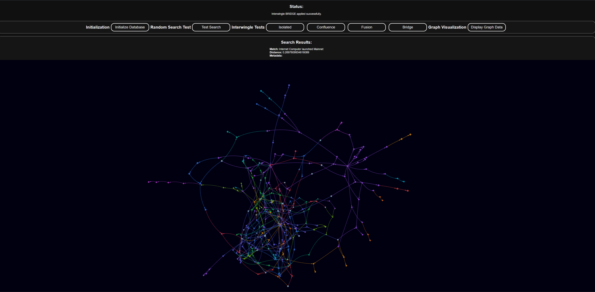

# 

# ⚡ React Testground for AI.js and ThinkableType
### **Version 1.0.0**

This template provides a robust environment for experimenting with AI.js and ThinkableType within a React-based web application. It is designed to facilitate the development and testing of AI-driven vector databases and knowledge graphs, all within a deployable framework for the Internet Computer (IC) blockchain network.

### **Current Configuration**
- **DFX:** 0.15.1
- **Dfinity:** 0.19.3

## 🚀 Getting Started

### **Easy Setup:**

Quickly set up your environment with a single command:

```bash
npm run setup
```

> **Note:**  
> If your DFX identity is password-protected, you'll need to enter your password during setup.

### **Manual Setup:**

If manual configuration is preferred, follow these steps:

```bash
npm install
dfx start --clean --background
dfx deploy
dfx stop
```

## 🔧 Development Workflow

### **Frontend Development:**

Start the frontend in development mode:

```bash
npm run dev
```

### **Backend Development:**

Run the backend with full debugging:

```bash
DEBUG=* node backend/server.js
```

## 🌐 Deploying to Mainnet

Deploy your testground to the IC mainnet with:

```bash
dfx deploy --network ic
```

> **Disclaimer:**  
> This template is actively maintained and subject to changes, including updates to the UI, Node/React versions, and Dfinity tooling.

## 📦 Integrated Packages

- **[AI.js](https://aijs.themaximalist.com/):** Embedding text into a vector database and executing intelligent queries.
- **[ThinkableType](https://thinkabletype.com/):** Building and visualizing knowledge graphs using vectorized data.

## 🛠️ How to Use This Testground

### **Data Management:**

- **Data Storage:**  
  Your dataset should be stored in the `data.json` file, formatted as per the example provided below. This file will be used to initialize the knowledge graph.

- **Embeddings:**  
  The `.embeddings.cache.json` file stores embeddings generated during your tests, enabling efficient querying and knowledge graph construction.

### **Example `data.json` File:**

```json
{
  "hyperedges": [
    ["Dominic Williams", "founded", "DFINITY Foundation"],
    ["DFINITY Foundation", "developed", "Internet Computer"],
    ["Internet Computer", "launched", "Mainnet"],
    ["Mainnet", "secured by", "Chain Key Technology"],
    ["Internet Computer", "uses", "WebAssembly"],
    ["WebAssembly", "powers", "Canisters"],
    ["Canisters", "host", "Smart Contracts"],
    ["Internet Computer", "supports", "ICP Tokens"],
    ["ICP Tokens", "used for", "Governance"],
    ["ICP Tokens", "used for", "Transaction Fees"]
  ]
}
```

### **Understanding the Logic:**

The `data.json` file is structured to define relationships between entities using a concept called "hyperedges." Each hyperedge is represented as an array of three elements:

- **Entity 1:** The starting point of the relationship (e.g., "Dominic Williams").
- **Relationship:** The nature of the connection between the entities (e.g., "founded").
- **Entity 2:** The endpoint of the relationship (e.g., "DFINITY Foundation").

This format is used to build a directed graph where nodes represent entities, and edges (connections) represent relationships between those entities.

## 🔌 API Usage Guide

This project offers several APIs to interact with AI.js and ThinkableType functionalities. Here’s how to use each API and integrate them into the frontend React code:

### **1. Initialize Database**

**Endpoint:** `POST /init`

**Description:** Initializes the ThinkableType instance with hyperedges from the `data.json` file and sets up the vector database using AI.js.

**Frontend Integration Example:**
```javascript
const initializeDB = async () => {
  try {
    setStatusMessage("Initializing database...");
    const response = await api.post("/api/init");
    setStatusMessage("Database initialized successfully.");
    console.log(response.data.message);
  } catch (error) {
    setStatusMessage("Error initializing database.");
    console.error("Error initializing the database:", error);
  }
};
```

### **2. Apply Interwingle**

**Endpoint:** `POST /interwingle`

**Description:** Applies a specified interwingle type (e.g., ISOLATED, CONFLUENCE, FUSION, BRIDGE) to the ThinkableType instance and returns the resulting graph data.

**Request Body:**
```json
{
  "type": "CONFLUENCE"
}
```

**Frontend Integration Example:**
```javascript
const handleInterwingle = async (type) => {
  try {
    setStatusMessage(`Applying Interwingle type: "${type}"...`);
    const response = await api.post("/api/interwingle", { type });
    setGraphData(response.data.data);
    setStatusMessage(`Interwingle ${type} applied successfully.`);
  } catch (error) {
    setStatusMessage("Error applying Interwingle.");
    console.error("Error applying Interwingle:", error);
  }
};
```

### **3. Search Vector Database**

**Endpoint:** `POST /search`

**Description:** Searches the vector database using a query string and returns the closest matches.

**Request Body:**
```json
{
  "query": "Internet Computer"
}
```

**Frontend Integration Example:**
```javascript
const handleSearch = async (searchQuery) => {
  try {
    setStatusMessage(`Searching for: "${searchQuery}"...`);
    const response = await api.post("/api/search", { query: searchQuery });
    setSearchResult(response.data.results);
    setStatusMessage(`Search completed for: "${searchQuery}".`);
  } catch (error) {
    setStatusMessage("Error performing search.");
    console.error("Error performing search:", error);
  }
};
```

### **4. Execute PageRank**

**Endpoint:** `POST /pagerank`

**Description:** Runs the PageRank algorithm on the current knowledge graph and returns the ranking of nodes.

**Frontend Integration Example:**
```javascript
const handlePageRank = async () => {
  try {
    setStatusMessage("Running PageRank...");
    const response = await api.post("/api/pagerank");
    setPageranks(response.data.pageranks);
    setStatusMessage("PageRank completed successfully.");
  } catch (error) {
    setStatusMessage("Error running PageRank.");
    console.error("Error running PageRank:", error);
  }
};
```

### **5. Fetch Graph Data**

**Endpoint:** `POST /graph`

**Description:** Retrieves the current nodes and links for visualization in the Force Graph 3D.

**Frontend Integration Example:**
```javascript
const fetchGraphData = async () => {
  try {
    setStatusMessage("Fetching graph data...");
    const response = await api.post("/api/graph");
    setGraphData(response.data.data);
    setStatusMessage("Graph data fetched successfully.");
  } catch (error) {
    setStatusMessage("Error fetching graph data.");
    console.error("Error fetching graph data:", error);
  }
};
```

## 🎯 AI Prompt for Generating Hyperedges JSON

Utilize this AI prompt to transform detailed project descriptions into a structured JSON dataset with hyperedges for your knowledge graph.

### **Prompt Instructions:**

1. **Output Format:**  
   Ensure the output is in valid JSON format without any deviations or errors.
   
2. **Structure:**  
   The JSON should contain a single key `"hyperedges"`, with its value being an array of arrays. Each inner array should consist of three elements: `[Entity1, Relationship, Entity2]`.
   
3. **Consistency:**  
   Accurately capture all relationships and roles mentioned in the input data within the hyperedges.
   
4. **No Extraneous Content:**  
   The output should contain only the JSON object, with no additional text or metadata.

### **Input Data:**
```
[Insert the detailed description here]
```

### **Example JSON Format:**
```json
{
  "hyperedges": [
    ["Entity1", "Relationship", "Entity2"],
    ["Entity3", "Relationship", "Entity4"]
  ]
}
```

### **Desired Output:**  
Please format the given input into a JSON dataset with hyperedges, adhering strictly to the structure shown in the example. The output must be in valid JSON format without any extraneous content.
